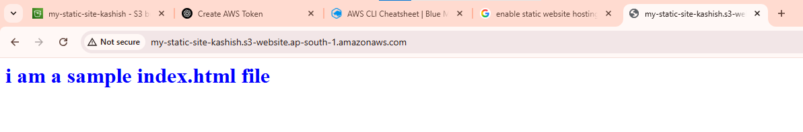

Host a Static Website on AWS S3
markdown
Copy
Edit

# 🌐 Static Website Hosting on AWS S3

This guide explains how to host a static website using Amazon S3 with public access and a custom error page.

---

## 📁 Bucket Name

`my-static-site-kashish`

---

## 🛠️ Steps to Host a Static Website

### 1. Create an S3 Bucket

```bash
aws s3 mb s3://my-static-site-kashish

### 2. Upload HTML Files

bash

aws s3 cp index.html s3://my-static-site-kashish/
aws s3 cp error.html s3://my-static-site-kashish/

### 3. Enable Static Website Hosting

bash

aws s3 website s3://my-static-site-kashish/ \
  --index-document index.html \
  --error-document error.html

4. Disable Public Access Block (Required for public websites)

 (through ui just uncehck bloack public access )
 warning: cause your bucket exposed to everyone on the internet. it should not hold any confidential information ..

bash

aws s3api put-public-access-block \
  --bucket my-static-site-kashish \
  --public-access-block-configuration '{
    "BlockPublicAcls": false,
    "IgnorePublicAcls": false,
    "BlockPublicPolicy": false,
    "RestrictPublicBuckets": false
  }'


5. Set Bucket Policy to Allow Public Read Access

bash

aws s3api put-bucket-policy \
  --bucket my-static-site-kashish \
  --policy '{
    "Version": "2012-10-17",
    "Statement": [
      {
        "Sid": "publicreadgetobject",
        "Effect": "Allow",
        "Principal": "*",
        "Action": "s3:GetObject",
        "Resource": "arn:aws:s3:::my-static-site-kashish/*"
      }
    ]
  }'
🌐 Access the Website
Use your S3 website endpoint:

http://my-static-site-kashish.s3-website-<region>.amazonaws.com

🔁 Replace <region> with your actual AWS region (e.g. us-east-1, ap-south-1, etc.)

🚨 Test Your Custom Error Page
Visit a non-existent path, such as:

bash

http://my-static-site-kashish.s3-website-<region>.amazonaws.com/doesnotexist



This should display your error.html page.

###This is your high level architecture for the same :

                +---------------------+
                |     Your Browser    |
                +---------+-----------+
                          |
                          v
            +-----------------------------+
            |    AWS S3 Static Website    |
            |  (my-static-site-kashish)   |
            +-----------------------------+
            |  index.html  | error.html   |
            +-----------------------------+
                          |
                          v
                https://my-static-site-kashish.s3-website-ap-south-1.amazonaws.com/

```
